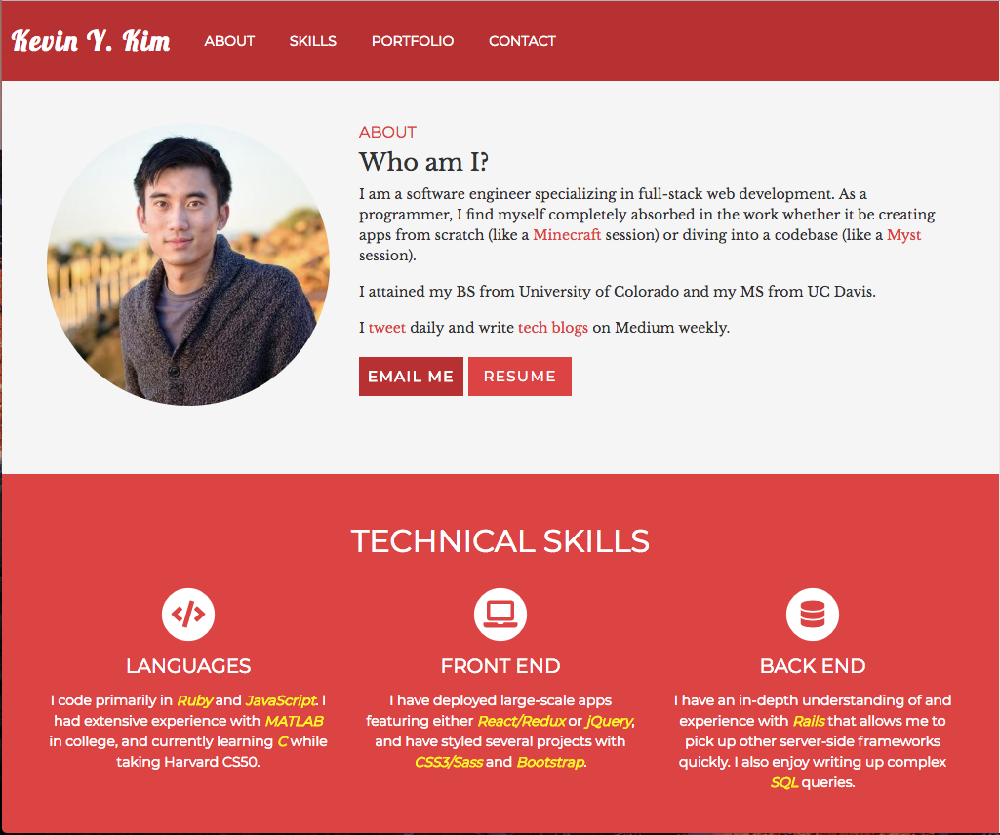
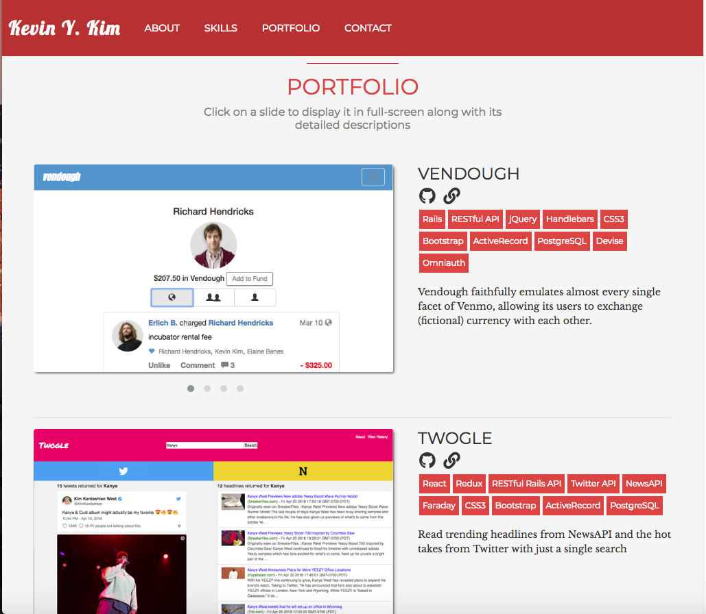

# Portfolio Website

This repo contains the source code for my portfolio site.

I built it using simple HTML, CSS, Bootstrap, and jQuery.

Check out the portfolio site [here](https://kevinyckim.netlify.com/).

## Installation

Clone the repo into your local environment.  Open up `index.html` in your browser and feel free to play around with it!

## Development

Developed by Kevin Y. Kim

## Contributing

Pull requests are welcome! Please follow the [Contributor's Code of Conduct](https://www.contributor-covenant.org/).
